# Simple Python Script to Visualize the Features Extracted by a CNN Filter

### If you want to dive into 3D convolutions and visualizations
  * [Python script to visualize 3D convolutions](https://iamanemic.github.io/3d_cnn_filter_visualization/)

### The first script is the my_convolution.py

First we import the libraries and then import the image of the cat.
The steps are well commented in the code, I will just explain the function that performs the convolution

We define the two filters explicitly to detect vertical and horizontal edges

#explicit vertical edge detecting filters
vertical_edge_filter = np.array([[1,0,-1],
                        [1,0,-1],
                        [1,0,-1]])

#explicit horizontal edge detecting filters
horizontal_edge_filter = np.array([[1,1,1],
                        [0,0,0],
                        [-1,-1,-1]])

As you can see from the above explicit filters that it would track a transition from dark to bright or vice-versa in the vertical or horizontal direction based on the matrix orientation. The 1 0 -1 would track a horizontal change in bright to dark and similarly the 1 0 -1 transpose would detect the same transition in the vertical direction. 

### The function that performs the convolution operation

The function takes two inputs, the input image and the filter matrix.

We create an empty zeros matrix for the feature matrix. The dimensions of the feature matrix is (img_size-filter_size+1) considering that we dont do any padding and use a stride of 1.

For each value on the feature matrix, feature_matrix[i,j], a slice of the image is taken equal to the dimensions of the filter and convolved with the filter.

Now we use a nested for loop to move through each element of the feature matrix we have created and to calculate the respective value by choosing the corresponding slice of the image and making a dot product with the filter and to evaluate the sum which will be stored in that feature matrix value (i,j). 

Once the loop completes running over the entire feature matrix, it would have evaluated the features obtained by convolving the input image with the input filter.

### Looking how the feature matrix looks like using the explicit vertical and horizontal filters

Use the function we created with the input image of the cat and the explicit vertical filter we defined

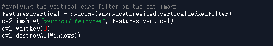
#### The feature matrix looks something like this 

#### The feature matrix for the horizontal filter looks like this

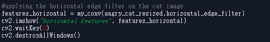

### Let us now try creating a feature with random values and see what that filter sees in the image

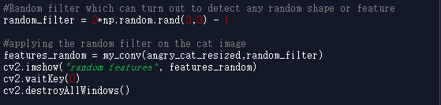

Keep re-initating the random matrix and observe the featueres 

#### The feature it could see is something like this

# Let us now look at the my_full_cnn.py script

This script is more generic function which can use zero padding and maxpooling with variable strides. This time we would run our filters on an RGB image and visualize about 8 filters. We are basically going to see what a these 8 filters are going to capture from an image.

Let us go through the functions one by one 

### Zero padding function

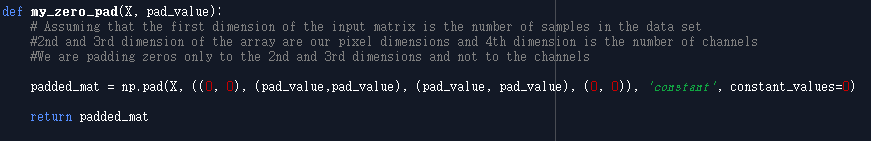

This is a straight forward implementation of zero padding using the inbuilt pad function from numpy

### Convolution function inclusive of stride, padding and bias

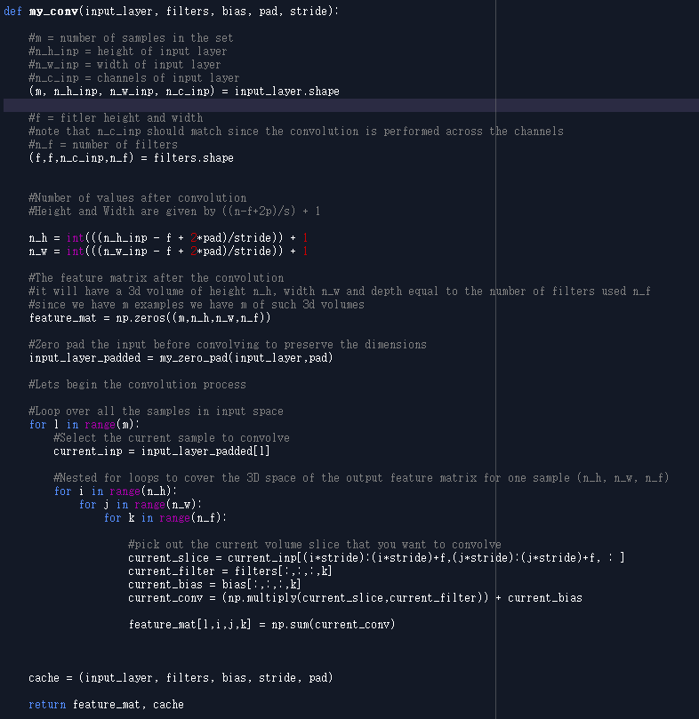

The function takes the input RGB image, the set of filters, the stride, bis and amount of padding as its inputs.

The steps are commented in the code as to what it is intended to do in each step.
The nested for loop iterates through all the values in the output feature volume (note that its a volume of features this time as we are considering multiple(8) filters at the same time). 
The loop iterates through each value in the output volume and calculates the feature value by considering the corresponding slice from the input image and convolving it with the selected filter (the last for loop with k, k changes from 0 to 7 changing from 1 filter to another). 
The dimension of the output feature volume is decided by the padding and the stride that we use (which are inputs to the function).
We basically perform the same process that we did with the grayscale image but this time we are obtaining a disgusting 3-D volume of features since we consider more than one filter instead of our first example where we obtained a pretty friendly 2-D matrix since we considered only one filter at a time.

No worries, once we get the feature volume, we can slice out the 3-D volume into 8 simpler 2-D matrices and visualize it as an image.

### Max Pooling Function

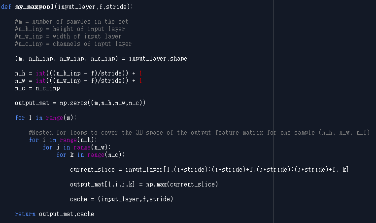

There is not much complications here, we just repeat the same kind of iterations over the feature volume as we did during convolution, but here we dont really perform any complex calculations, we just consider a slice at a time and reduce that slice into one value by replacing that whole slice by the maximum value contained within it.
This is essentially a function we use to reduce the dimensions to enhance computation and also to introduce the property of spatial invariance of features that we detect.

### Implementing filters on the cat image

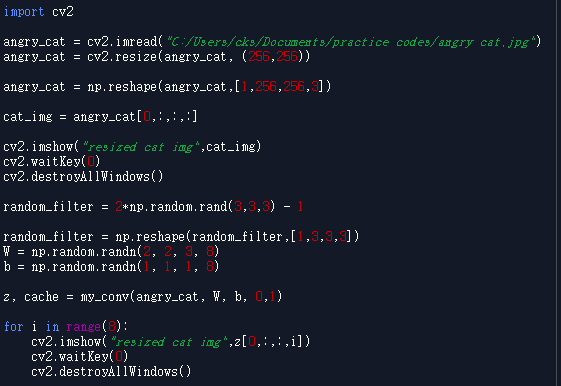

We import the RGB image of that angry cat and resize it to 256x256

we use W with the 4th dimension as 8, this matrix is the weight matrix or the filters in our CNN case.
When we use this W matrix (consisting of 8 filters) in our function on the image of the angry cat, we obtain some interesting results.

### Let us now get to the intersting part 

Let us now see what our 8 filters actually see/capture in the input image.
#### Actual RGB Image
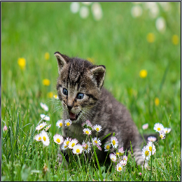

#### Filter 1
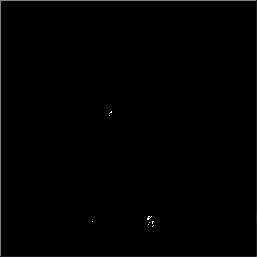

#### Filter 2
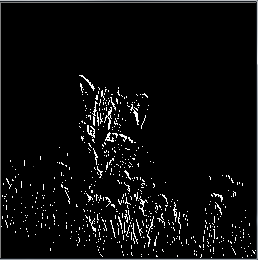

#### Filter 3
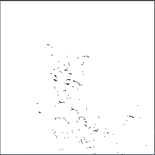

#### Filter 4
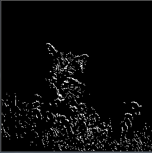

#### Filter 5
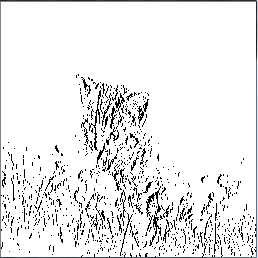

#### Filter 6
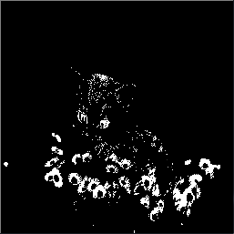

#### Filter 7
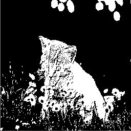

#### Filter 8
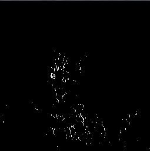

I encourage you to predefine filters or keep randomizing them and re-visualizing these feature volumes. 

**Final note** : All these filter visualizations help us understand how a filter captures information or features from an image. 
The Convolutional Neural Network in reality starts off with random filters such as these but would refine them to detect specific features during training by means of back propagation. The code my_full_cnn.py also contains a function that would perform back propagation (just for understanding the concept and math behind back propagation)

### If you want to dive into 3D convolutions and visualizations
  * [Python script to visualize 3D convolutions](https://iamanemic.github.io/3d_cnn_filter_visualization/)
