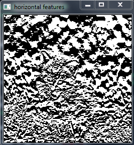

# Simple Python Script to Visualize the Features Extracted by a CNN Filter

### The first script is the my_convolution.py

First we import the libraries and then import the image of the cat.
The steps are well commented in the code, I will just explain the function that performs the convolution

We define the two filters explicitly to detect vertical and horizontal edges

#explicit vertical edge detecting filters
vertical_edge_filter = np.array([[1,0,-1],
                        [1,0,-1],
                        [1,0,-1]])

#explicit horizontal edge detecting filters
horizontal_edge_filter = np.array([[1,1,1],
                        [0,0,0],
                        [-1,-1,-1]])

As you can see from the above explicit filters that it would track a transition from dark to bright or vice-versa in the vertical or horizontal direction based on the matrix orientation. The 1 0 -1 would track a horizontal change in bright to dark and similarly the 1 0 -1 transpose would detect the same transition in the vertical direction. 

### The function that performs the convolution operation

The function takes two inputs, the input image and the filter matrix.

We create an empty zeros matrix for the feature matrix. The dimensions of the feature matrix is (img_size-filter_size+1) considering that we dont do any padding and use a stride of 1.

For each value on the feature matrix, feature_matrix[i,j], a slice of the image is taken equal to the dimensions of the filter and convolved with the filter.

Now we use a nested for loop to move through each element of the feature matrix we have created and to calculate the respective value by choosing the corresponding slice of the image and making a dot product with the filter and to evaluate the sum which will be stored in that feature matrix value (i,j). 

Once the loop completes running over the entire feature matrix, it would have evaluated the features obtained by convolving the input image with the input filter.

### Looking how the feature matrix looks like using the explicit vertical and horizontal filters

Use the function we created with the input image of the cat and the explicit vertical filter we defined
features_vertical = my_conv(angry_cat_resized,vertical_edge_filter)
cv2.imshow("vertical features", features_vertical)
cv2.waitKey(0)
cv2.destroyAllWindows()

#### The feature matrix looks something like this 

#### The feature matrix for the horizontal filter looks like this

### Let us now try creating a feature with random values and see what that filter sees in the image

random_filter = 2*np.random.rand(3,3) - 1

#applying the random filter on the cat image
features_random = my_conv(angry_cat_resized,random_filter)
cv2.imshow("random features", features_random)
cv2.waitKey(0)
cv2.destroyAllWindows()

Keep re-initating the random matrix and observe the featueres 

#### The feature it could see is something like this

